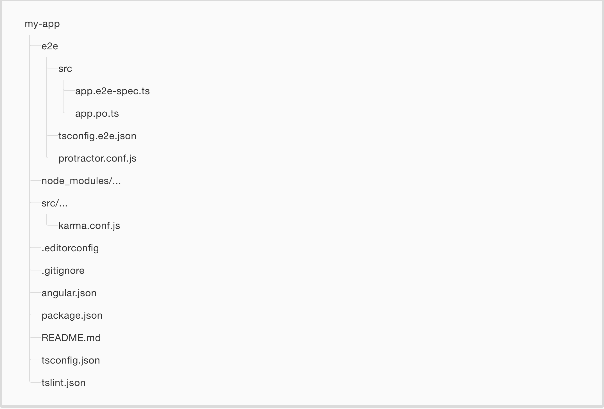
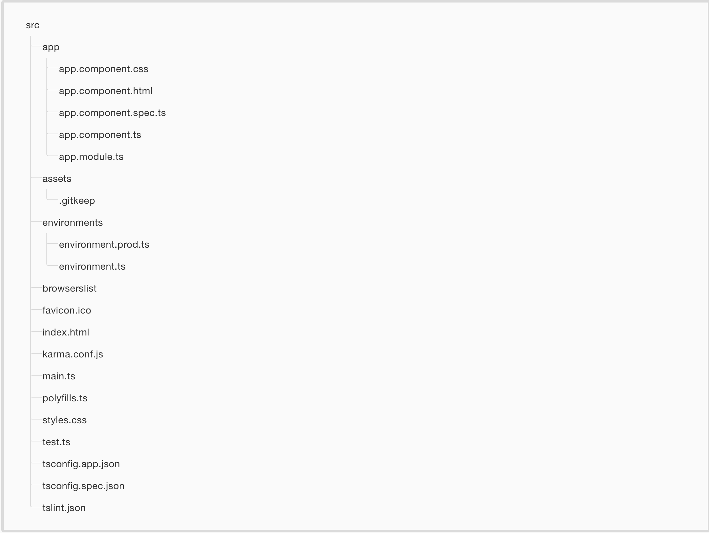

# File structure of an Angular 6 project

## Root directory

The root directory of an angular project contains the following elements:

* **e2e/:** end-to-end tests
* **node_modules/:** Npm packages.
* **src/:** Directory where the app is
* **.editorconfig:** Configuration for code editors.  (http://editorconfig.org)
* **.gitignore:** Specifies intentionally untracked files that Git should ignore.
* **angular.json:** CLI configuration for all projects in the workspace, including configuration options for build, serve, and test tools that the CLI uses, such as Karma and Protractor.
* **package.json:** Configuration of npm package dependencies
* **README.md:** Introductory documentation.
* **tsconfig-app.json:** Default TypeScript configuration for apps in the workspace.
* **tsconfig-spec.json:** Default TypeScript configuration for e2e test apps in the workspace.
* **tslint.json:** Default TSLint configuration for apps in the workspace.

## src directory

The src/ directory contains the following elements:

* **app/app.component.{ts,html,css,spec.ts}:** The root component (typescript file, html file, css file and spec.ts file).
* **app/app.module.ts:** The root module
* **assets/:** Directory for the assets (it will be copied as such when building the application).
* **environments/:** This directory contains one file for each environment. In it is the configuration of some variables that are used in the application. For example, maybe you use a different REST API during the development that you will use in production, different analytics tokens, mock services ... Angular cli chooses the appropriate file in each case.
* **browserslist:** Configures sharing of **target browsers** and Node.js versions among various front-end tools.
* **favicon.ico:** The favicon icon.
* **index.html:** The root html.
* **karma.conf.js:** Karma configuration (for unit tests)
* **main.ts:** The entry point of the application.
* **polyfills.ts:** A polyfill to support old browsers.
* **styles.css:** Global CSS styles of the application.
* **test.ts:** Main entry point to the unit tests.
* **tsconfig.app.json:** Inherits from the workspace-wide tsconfig.json file.
* **tsconfig.spec.json:** Inherits from the workspace-wide tsconfig.json file.
* **tslint.json:** Inherits from the workspace-wide tslint.json file.

Note: The two images in this section are screenshots of the official Angular documentation.

[Índice](index.md)
