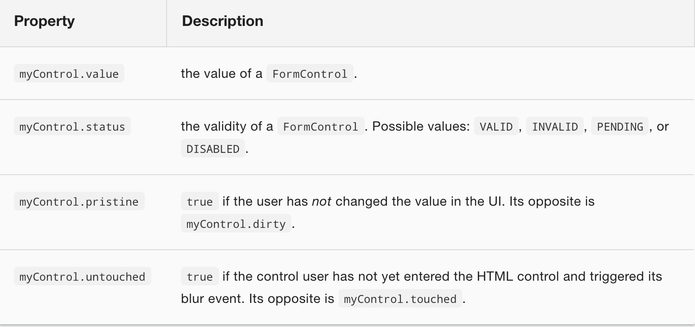

# Model-driven forms (Reactive forms)

The **ReactiveFormsModule** module offers ease of using patterns, testing and validations directly from the component instead of from the template.

We will use the following starting form:

```html
<div>
    <h1>Hero Form</h1>

    <form>
      <div>
        <label for="name">Name</label>
        <input type="text" id="name" name="name">
      </div>

      <div>
        <label for="alterEgo">Alter Ego</label>
        <input type="text" id="alterEgo" name="alterEgo">
      </div>

      <div>
        <label for="power">Hero Power</label>
        <select id="power"  name="power">
          <option *ngFor="let pow of powers" [value]="pow">{{pow}}</option>
        </select>
      </div>

      <div>
        <div>
          <h4>Address</h4>
          <div>
            <div>
              <label>Street:
                <input>
              </label>
            </div>
            <div>
              <label>City:
                <input>
              </label>
            </div>
            <div>
              <label>State:
                <input>
              </label>
            </div>
            <div>
              <label>Zip Code:
                <input>
              </label>
            </div>
          </div>
          <br>

        </div>
      </div>


      <button type="submit">Submit</button>

    </form>
</div>
```

And this starting component

```typescript
  import { Component } from '@angular/core';
  import { Hero }    from './hero';

  @Component({
    selector: 'hero-form',
    templateUrl: './hero-form.component.html'
  })
  export class ReactiveFormComponent {

    powers = ['Really Smart', 'Super Flexible',
              'Super Hot', 'Weather Changer'];

    hero = new Hero(18, 'Dr IQ', this.powers[0], 'Chuck Overstreet');
  }
```

Now, we import the ReactiveFormsModule module from *@angular/forms*

```typescript
import { ReactiveFormsModule } from '@angular/forms';

@NgModule({
  imports: [
    ...
    ReactiveFormsModule,
    ...
  ],
```

Contrary to the *template-driven* forms, with this approach all the programming will be in the component.

## Essential classes

It is convenient to take a look at the classes that provides *ReactiveFormsModule*:

- **AbstractControl:** It is the abstract base class of the other 3 classes: FormControl, FormGroup, and FormArray.
- **FormControl:** Controls the value and validity status of an individual form control. It corresponds to an HTML form control as an input or a select.
- **FormGroup:** Controls the value and validity of a group of AbstractControl instances. Every form is a unique FormGroup. Already within that FormGroup there can be any amount of FormControl, FormGroup or FormArray
- **FormArray:** Controls the value and validity status of an array of AbstractControl instances.

## Basic FormGroup

```typescript
  export class ReactiveFormComponent {
    heroForm: FormGroup;

    constructor(private fb: FormBuilder) {
      this.createForm();
    }

    createForm() {
      this.heroForm = this.fb.group({
        name: ['', Validators.required ],
        street: '',
        city: '',
        state: '',
        zip: '',
        power: '',
        alterEgo: ''
      });
    }
  }
```

In this example, the heroForm form consists of a FormGroup with 7 FormControls.

Practically the only thing that we will have to do in the HTML is to associate the form with the FormGroup heroForm

```html
  <form [formGroup]="heroForm">
```

and every HTML control with its corresponding FormControl.

```html
  <input formControlName="name">
```

## Nesting FormGroups

We can make a little change to better organise the controls and to demonstrate that a FormGroup can host another FormGroup.

```typescript
  createForm() {
    this.heroForm = this.fb.group({ 
      name: ['', Validators.required ],
      address: this.fb.group({
        street: '',
        city: '',
        state: '',
        zip: ''
      }),
      power: '',
      alterEgo: ''
    });
```

But then, we must "bind" some HTML element to the address FormGroup with **[formGroupName]**.

```html
<div>
    <div [formGroupName]="address">
        <h4>Address</h4>
        <div>
            <div>
              <label>Street:
                <input formControlName="street">
              </label>
            </div>
```

So now, Angular knows that this input corresponds to the street FormControl inside the address FormGroup inside the root FormGroup.

Now is a good time to interpolate some variables to see what is happening:

```html
    <p>Hero: {{ hero | json }}</p>
    <p>Form value: {{ heroForm.value | json }}</p>
    <p>Form status: {{ heroForm.status | json }}</p>
```

A group can be builded directly from an object model:

```typescript
  this.addressGroupControl = this.fb.group(new Address());
```

## FormControl

We can instantiate FormControl objects. And then use it to build a FormGroup.

```typescript
  this.alterEgoControl = new FormControl('Default Value', Validators.required);

  this.heroForm = this.fb.group({
      name: 'Default Name',
      alterEgo: this.alterEgoControl
      address: this.addressGroupControl
  });
```

## FormGroup.get()

Or we can build de FormGroup and then get the individual FormControl instance with the .get() method.

```typescript
  this.heroForm = this.fb.group({ 
      name: ['', Validators.required ],
      address: this.fb.group({
        street: '',
        city: '',
        state: '',
        zip: ''
      }),
      power: '',
      alterEgo: ['Default Value', Validators.required ],
    });

  this.alterEgoControl = this.heroForm.get('alterEgo');
  this.streetControl = this.heroForm.get('address.street');
```

FormControl class has properties (inherited from AbstractControl) to know the value and the status of a control.



And has methods to manipulate the group (add a control, remove a control...).

## Validators

The full list of validatos can be consulted here:

https://angular.io/api/forms/Validators

## FormGroup.setValue()

We can set values at any time to the complete form with setValue. You can associate the values of an entire object if the properties of the object and the form match.

```typescript
  this.heroForm.setValue({
    name:    this.hero.name,
    address: this.hero.addresses[0] || new Address()
  });
```

## FormGroup.reset() and FormGroup.resetForm()

We can reset the form with the .reset() method:

```typescript
  this.heroForm.reset();
```

The form now resets, all the input fields go back to their initial state and any valid, touched or dirty properties are also reset to their starting values.

The reset() method is inherited form AbstractControl so we can reset FormGroups, FormControls o FormArrays.

We can pass a value to the method to reset to some concrete value

```typescript
  this.form.reset(this.model);
```

FormGroup has also a resetForm that also resets the state of the submitted property

```typescript
  this.form.resetForm(this.model);
```


## FormArray

Heroes can have more than one address. So we need to make some changes to the Form in order to reflect that.  

```typescript
this.heroForm = this.fb.group({
  name: ['', Validators.required ],
  addresses: this.fb.array([]),
  power: '',
  sidekick: ''
});
```

A FormArray represents an array of AbstracControls.

This FormArray can be traversed by the **.controls** property. With the .controls property and the **formArrayName** directive we must adjust our HTML.

```html
<div formArrayName="addresses" class="well well-lg">
  <div *ngFor="let address of addresses.controls; let i=index" [formGroupName]="i" >
    <!-- The repeated address template -->
  </div>
</div>
```

Adding more elements to the FormArray is done withe the push() method, just like with normal arrays.

```html
<button (click)="addAddress()" type="button">Add address</button>
```

```typescript
addAddress() {
  this.heroForm.get('addresses').push(this.fb.group(new Address()));
}
```

FormArray class has methods to manipulate the array (add controls, remove controls...).

## Observe changes in a control

Reactive forms have some features that work with Observables. For example, the AbstractControl class has a *valueChanges* method that returns an Observable every time the value of the FormControl, FormGroup or FormArray changes.

```typescript
  nameChangeLog: string[] = [];

  constructor(private fb: FormBuilder) {
    this.createForm();
    this.logNameChange();
  }

  logNameChange() {
    const nameControl = this.heroForm.get('name');
    nameControl.valueChanges.subscribe(
      (value: string) => this.nameChangeLog.push(value)
    );
  }
```


