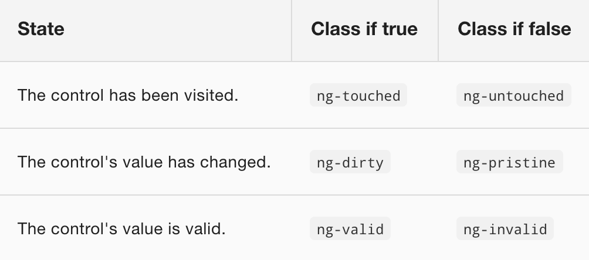

# Template-driven forms

It is possible to build almost any form with Angular templates. You can place the elements with freedom and creativity, bind the controls with the data, specify validation rules and show validation errors, enable and disable controls according to conditions ...

We are going to use the power of the Angular forms to the following example:

```html
  <div>
      <h1>Hero Form</h1>
      <form>
        <div>
          <label for="name">Name</label>
          <input type="text" id="name" name="name" required>
        </div>
  
        <div>
          <label for="alterEgo">Alter Ego</label>
          <input type="text" id="alterEgo" name="alterEgo">
        </div>

        <div>
          <label for="power">Hero Power</label>
          <select id="power"  name="power" required>
            <option *ngFor="let pow of powers" [value]="pow">{{pow}}</option>
          </select>
        </div>
  
        <button type="submit">Submit</button>
  
      </form>
  </div>
```

```typescript
  import { Component } from '@angular/core';
  import { Hero }    from './hero';

  @Component({
    selector: 'hero-form',
    templateUrl: './hero-form.component.html'
  })
  export class HeroFormComponent {

    powers = ['Really Smart', 'Super Flexible',
              'Super Hot', 'Weather Changer'];

    hero = new Hero(18, 'Dr IQ', this.powers[0], 'Chuck Overstreet');
  }
```

There is a module in the *@angular/forms* called *FormsModule* that gives us access to the types *ngForm* and *ngModel* to type variables and the *ngModel* directive that we have already used to do two-way binding. From Angular 5 we also have the *ngModelOptions* directive.

```typescript
  imports: [
    ...
    FormsModule,
    ...
  ],
```

## Two-way data binding with ngModel

We do not see the hero's data in the form because we have not yet made a binding with the hero.

We use *ngModel* to associate each control of the form with a property of the hero. Remember that in order to use *ngModel* it is necessary to declare the *name* attribute.

We will also use a kind of spy to verify that the binding is actually done.

```html
  <div class="container">
      <h1>Hero Form</h1>
      <form>
        {{hero | json}}
        <div>
          <label for="name">Name</label>
          <input type="text" id="name" required [(ngModel)]="hero.name" name="name">
        </div>

        <div>
          <label for="alterEgo">Alter Ego</label>
          <input type="text" id="alterEgo" [(ngModel)]="hero.alterEgo" name="alterEgo">
        </div>

        <div>
          <label for="power">Hero Power</label>
          <select id="power"  name="power" required [(ngModel)]="hero.power" name="power">
            <option *ngFor="let pow of powers" [value]="pow">{{pow}}</option>
          </select>
        </div>

        <button type="submit">Submit</button>

      </form>
  </div>
```

## Visually mark the status of the controls

Using ngModel in a form provides much more than just two-way data binding. It also informs if the user has touched the control, if the value has changed or if the value is valid or not.

The ngModel directive updates the control with Angular special CSS classes that reflect the status of the control. Those classes can be used to change the appearance of the control.



We are going to add a template variable called spy to the *name* input to see the associated css classes at each moment.

```html
  <div class="form-group">
    <label for="name">Name</label>
    <input type="text" id="name" required [(ngModel)]="hero.name" name="name" #spy>
    <br>{{spy.className}}
  </div>
```

Thanks to these classes we can visually mark the state of the controls with css.

```css
  .ng-valid[required], .ng-valid.required  {
    border-left: 5px solid #42A948; /* green */
  }

  .ng-invalid:not(form)  {
    border-left: 5px solid #a94442; /* red */
  }
```

## Show and hide validation error messages

We are going to put another template reference variable to the *name* control but typing it to the type ngModel.

```html
  <div class="form-group">
    <label for="name">Name</label>
    <input type="text" id="name" required [(ngModel)]="hero.name" name="name" #spy #name="ngModel">
    <br>{{spy.className}}
  </div>
```

We will also add an error message, which will appear when the name is empty.

```html
  <div class="form-group">
    <label for="name">Name</label>
    <input type="text" id="name" required [(ngModel)]="hero.name" name="name" #spy #name="ngModel">
    <br>{{spy.className}}
  </div>
  <div [hidden]="name.valid || name.pristine">
    Name is required
  </div>
```

## Submit the form with ngSubmit event

```html
  <form (ngSubmit)="onSubmit()">
  ...
  <button type="submit">Submit</button>
```

```typescript
  onSubmit() {
    //Do whatever
    //...
    //and then clean the form:
    this.hero.name = '';
    this.hero.power = this.powers[0];
    this.hero.alterEgo = '';
  }
```

## Disable the submit button until the form is valid

Vamos a poner otro template reference variable al formulario, ahora de tipo ngForm

```html
  <form (ngSubmit)="onSubmit()" #heroForm="ngForm">
```

Un objeto ngForm tiene una propiedad *form* que es a su vez otro objeto. Este último objeto tiene una 
propiedad booleana *valid* que indica si el formulario es válido o no.

Así pues, podemos desactivar el botón de submit y no activarlo hasta que el formulario sea válido.

```html
  <form (ngSubmit)="onSubmit()" #heroForm="ngForm">
  ...
  <button type="submit" [disabled]="!heroForm.form.valid">Añadir</button>
```


## Reset the form

The ngForm object also has a *reset()* method that completely cleans the form.

```html
  <form (ngSubmit)="onSubmit(); heroForm.reset()" #heroForm="ngForm">
```

De esta forma, el componente no necesita ocuparse de esa tarea

```typescript
  onSubmit() {
    //Do whatever
    //...
  }
```

## Show a message when the form is submitted

```html
<div [hidden]="!heroForm.submitted">
  <h2>Thank you!</h2>
</div>
```

## ngModelOptions directive

### updateOn

Forms default behabiour is to update in every keypress. But we can change that behaviour with the **updateOn** option.

```html
  <div class="form-group">
    <label for="name">Name</label>
    <input type="text" id="name" required [(ngModel)]="hero.name" name="name" #name="ngModel" [ngModelOptions]="{updateOn: 'blur'}">
  </div>
```

And we can do the same for the whole form

```html
<form [ngModelOptions]="{updateOn: 'submit'}">
```

[Índice](index.md)
