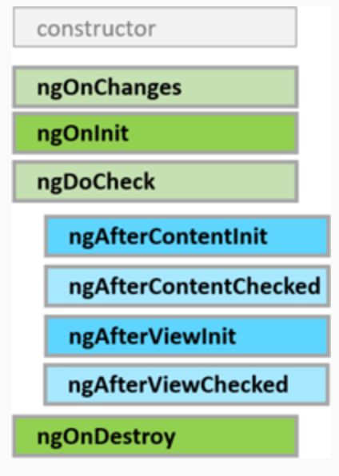

# Component Lifecycle

Every component has a life cycle managed by Angular.

Angular creates the component, renders it, creates and renders its "children", checks it when its binded data changes and destroys it before removing it from the DOM.

Angular offers hooks from each step of the life cycle to provide the ability to act when they take place.

A directive has the same set of *lifecycle hooks* except those specific to the component's content and views.

## Lifecycle sequence



- **ngOnChanges():** 
Respond when Angular (re)sets data-bound input properties. The method receives a SimpleChanges object of current and previous property values.
Called before ngOnInit() and whenever one or more data-bound input properties change.
- **ngOnInit():**	
Called once, after the first ngOnChanges().
- **ngDoCheck():**
It is called during each change detection cycle, after each ngOnChanges() and after ngOnInit(). It can be used to manage changes that Angular is not able to handle on its own.
- **ngAfterContentInit():**
Respond after Angular projects external content into the component's view / the view that a directive is in.
Called *once* after the first ngDoCheck().
- **ngAfterContentChecked():**	
Respond after Angular checks the content projected into the directive/component.
Called after the ngAfterContentInit() and every subsequent ngDoCheck().
- **ngAfterViewInit():**	
Respond after Angular initializes the component's views and child views / the view that a directive is in.
Called once after the first ngAfterContentChecked().
- **ngAfterViewChecked():**	
Respond after Angular checks the component's views and child views / the view that a directive is in.
Called after the ngAfterViewInit and every subsequent ngAfterContentChecked().
- **ngOnDestroy():**
Cleanup just before Angular destroys the directive/component. Unsubscribe Observables and detach event handlers to avoid memory leaks.
Called just before Angular destroys the directive/component.


Exercise: Put console.log() in every of the lifecycle methods of ParentComponent and ChildComponent. Play and inspect what happens.

```ts
ngOnInit() {
  console.log('ngOnInit');
}

ngOnChanges() {
  console.log('ngOnChanges');
}

ngDoCheck() {
  console.log('ngDoCheck');
}

ngAfterContentInit() {
  console.log('ngAfterContentInit');
}

ngAfterContentChecked() {
  console.log('ngAfterContentChecked');
}

ngAfterViewInit() {
  console.log('ngAfterViewInit');
}

ngAfterViewChecked() {
  console.log('ngAfterViewChecked');
}

ngOnDestroy() {
  console.log('ngOnDestroy');
}
```


[Índice](index.md)
